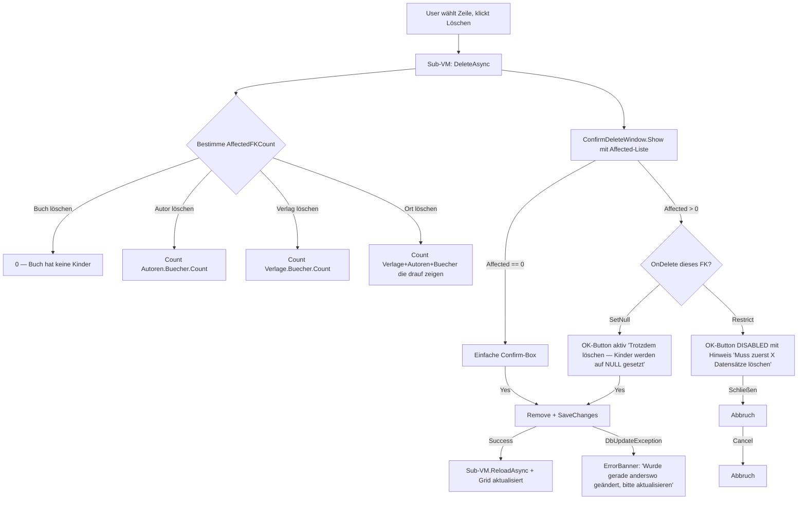

# BibWpf — Schritt 3 (CRUD) — Plan

> **Status:** Read-only Navigation läuft (Schritte 1 + 2 abgeschlossen).
> **Ziel:** Add / Edit / Delete für alle vier Bereiche (Bücher, Autor:innen, Verlage, Orte) mit mod­alen Dialogen, FK-Dropdowns, Live- und DB-Constraint-Validierung sowie kaskadierendem Löschen (Zwei-Stufen-Dialog).

---

## 1. Architektur — Entscheidungen aus den Klärungsfragen

| Bereich | Entscheidung |
|---|---|
| **Edit/Add-UI** | Modal-Dialog pro Bereich (4 EditDialog-UserControls + 4 EditDialogViewModels) |
| **Delete-Verhalten** | Zwei-Stufen-Dialog: erst Affected-Count anzeigen, dann Choice "Trotzdem löschen & auf NULL setzen" nur bei SetNull-beziehungen möglich; Restrict bleibt Hard-Block |
| **Validierung** | Beides: `ObservableValidator` (DataAnnotations) im Dialog + `DbUpdateException`-Catch beim Save in ErrorBanner |
| **DI** | Wie bisher: Generic Host in [`App.xaml.cs`](App.xaml.cs:1), DbContext + VMs in `IServiceCollection`, scoped Lifetime |
| **Navigation** | Wie bisher: `DataTemplates` in [`App.xaml`](App.xaml:1) → VM-Typ → View |

---

## 2. Neue Datei-Struktur

```
ViewModels/
├── BaseViewModel.cs                       (existiert — bekommt Save/Reload-Stubs)
├── MainViewModel.cs                       (existiert)
├── BuecherViewModel.cs                    (Read-Only — bleibt, bekommt ReloadAsync)
├── AutorenViewModel.cs                    (Read-Only — bleibt)
├── VerlageViewModel.cs                    (Read-Only — bleibt)
├── OrteViewModel.cs                       (Read-Only — bleibt)
├── Dialogs/
│   ├── BaseEditDialogViewModel.cs         (NEU: ObservableValidator-Shell mit DialogResult/Close)
│   ├── BuecherEditDialogViewModel.cs      (NEU)
│   ├── AutorenEditDialogViewModel.cs      (NEU)
│   ├── VerlageEditDialogViewModel.cs      (NEU)
│   └── OrteEditDialogViewModel.cs         (NEU)
Views/
├── BuecherView.xaml                       (Toolbar: Neu | Bearbeiten | Löschen — Buttons binden an VM)
├── AutorenView.xaml                       (dto.)
├── VerlageView.xaml                       (dto.)
├── OrteView.xaml                          (dto.)
├── Dialogs/                               (NEU)
│   ├── ConfirmDeleteWindow.xaml           (NEU: Two-Stage-Confirm)
│   └── BuecherEditDialog.xaml             (NEU + 4 weitere)
Dialogs/BuecherEditDialog.xaml.cs
Dialogs/AutorenEditDialog.xaml.cs
Dialogs/VerlageEditDialog.xaml.cs
Dialogs/OrteEditDialog.xaml.cs
Dialogs/ConfirmDeleteWindow.xaml.cs
```

**Neue Dateien gesamt:** 5 EditDialog-ViewModels + 5 Dialog-UserControls + 1 Confirm-Dialog (VM-less) + Ergänzungen.

---

## 3. Sub-VMs erweitern (ReloadAsync + CRUD-API)

Jeder bestehende Sub-VM (`BuecherViewModel`, `AutorenViewModel`, `VerlageViewModel`, `OrteViewModel`) bekommt:

```csharp
public partial class BuecherViewModel : BaseViewModel
{
    // NEU:
    [ObservableProperty] private Buch? _selectedItem;            // DataGrid-Selection
    public bool CanEditOrDelete => SelectedItem is not null;

    [RelayCommand(CanExecute = nameof(CanEditOrDelete))]
    private async Task AddAsync() { /* ... */ }
    [RelayCommand(CanExecute = nameof(CanEditOrDelete))]
    private async Task EditAsync() { /* ... */ }
    [RelayCommand(CanExecute = nameof(CanEditOrDelete))]
    private async Task DeleteAsync() { /* ... */ }

    partial void OnSelectedItemChanged(Buch? value)
        => AddEditDeleteCommands.NotifyCanExecuteChanged();

    // NEU:async Reload (statt nur sync im Konstruktor)
    public Task ReloadAsync() { /* bereits eager-loaded, jetzt wartbar */ }
}
```

**Wichtig:** Die `BuecherViewModel` aktuell lädt im Konstruktor synchron (Schritt 2) — das bleibt ok, der Konstruktor feuert nur einmal beim DI-Resolve. Für **Navigations-Resets** wäre `ReloadAsync` schön, aber für Schritt 3 nicht nötig (vermutlich erst Schritt 4).

---

## 4. EditDialogViewModel — Basis-Klasse

```csharp
public abstract partial class BaseEditDialogViewModel<T> : ObservableValidator
{
    [ObservableProperty]
    private T? _entity;            // bearbeitete Entität

    [ObservableProperty]
    private string? _dbErrorMessage;  // von DbUpdateException

    public abstract string Title { get; }

    public bool HasErrors => HasErrors;                  // ObservableValidator hat das schon
    public bool HasDbErrors => !string.IsNullOrEmpty(DbErrorMessage);

    // OK/Save:
    [RelayCommand(CanExecute = nameof(CanSave))]
    protected abstract Task SaveAsync(LibraryDbContext db);

    protected bool CanSave() => !HasErrors;

    // Dialog-Close-Handling:
    public event EventHandler<DialogResultEventArgs>? RequestClose;
}
```

**Dialog-Lifecycle:**
1. Sub-VM instanziiert passendes EditDialogViewModel (Scope-erstellt, damit DbContext frisch ist)
2. Setzt Entity = `null` (Add) oder `selectedItem` kopiert (Edit)
3. `Dialog.ShowDialog()` modal
4. Bei OK → `SaveAsync` → `SaveChangesAsync` → `RequestClose(true)` → Sub-VM-Reload
5. Bei Cancel → `RequestClose(false)`

---

## 5. Edit-Dialog-XAML — Beispiel `BuecherEditDialog.xaml`

```xml
<Window x:Class="BibWpf.Dialogs.BuecherEditDialog" ...>
  <Grid>
    <Grid.RowDefinitions>
      <RowDefinition Height="*"/>           <!-- Form -->
      <RowDefinition Height="Auto"/>        <!-- ErrorBanner -->
      <RowDefinition Height="Auto"/>        <!-- Buttons -->
    </Grid.RowDefinitions>
    <StackPanel Grid.Row="0" Margin="12">
      <Label Content="Titel"/>
      <TextBox Text="{Binding Entity.Titel, UpdateSourceTrigger=PropertyChanged, ValidatesOnNotifyDataErrors=True}"/>
      <Label Content="ISBN (optional)"/>
      <TextBox Text="{Binding Entity.Isbn, UpdateSourceTrigger=PropertyChanged, ValidatesOnNotifyDataErrors=True}"/>
      ...
      <Label Content="Autor"/>
      <ComboBox ItemsSource="{Binding AutorenListe}" SelectedValuePath="Id"
                SelectedValue="{Binding Entity.AutorId, ValidatesOnNotifyDataErrors=True}"/>
      ... (Verlag, Ort)
    </StackPanel>
    <Border Grid.Row="1" Background="#5A1D1D" Padding="8"
            Visibility="{Binding HasDbErrors, Converter={...}}">
      <TextBlock Text="{Binding DbErrorMessage}" Foreground="White"/>
    </Border>
    <StackPanel Grid.Row="2" Orientation="Horizontal" HorizontalAlignment="Right" Margin="8">
      <Button Content="Abbrechen" Command="{Binding CancelCommand}" Margin="0,0,8,0"/>
      <Button Content="Speichern" Command="{Binding SaveCommand}" IsDefault="True"/>
    </StackPanel>
  </Grid>
</Window>
```

`ErrorMessage`-Converter (Bool→Visibility) wird einmal in `App.xaml` als globaler StaticResource registriert.

---

## 6. FK-Dropdown-Befüllung

Jeder Edit-Dialog-VM bekommt `public ObservableCollection<...> AutorenListe { get; }` etc., gefüllt via eigenem `LibraryDbContext`-Scope:

```csharp
public BuecherEditDialogViewModel(LibraryDbContext db, Buch? existing)
{
    _db = db;
    Entity = existing ?? new Buch();
    AutorenListe = new ObservableCollection<Autor>(
        db.Autoren.AsNoTracking().OrderBy(a => a.Nachname).ToList());
    VerlageListe = ...; OrteListe = ...;
}
```

Wenn ein Bereich gelöscht wird, in dem das aktuelle Form zeigt, muss die `Liste` aktualisiert werden — das passiert durch `ReloadAsync()` der Sub-VM nach jeder CRUD-Operation (Liste kommt ja aus dem DB).

---

## 7. Delete-Flow (Zwei-Stufen-Dialog)



Buch hat keine abhängigen Kinder → einfache ConfirmBox.

---

## 8. Validierung — Detailgrad pro Entität

### Models — DataAnnotations hinzufügen

```csharp
public class Buch
{
    [Required(ErrorMessage = "Titel ist erforderlich.")]
    [StringLength(200)]
    public string Titel { get; set; } = string.Empty;

    [StringLength(17, MinimumLength = 10)]   // ISBN-10 oder -13
    public string? Isbn { get; set; }

    [Range(0, 9999, ErrorMessage = "Jahr muss realistisch sein.")]
    public int Erscheinungsjahr { get; set; }

    [Range(1, 9999)]
    public int? Seiten { get; set; }
}
public class Autor
{
    [Required, StringLength(100)]
    public string Vorname { get; set; } = string.Empty;
    [Required, StringLength(100)]
    public string Nachname { get; set; } = string.Empty;
    [Range(1000, 9999)]
    public int? Geburtsjahr { get; set; }
}
public class Verlag
{
    [Required, StringLength(150)]
    public string Name { get; set; } = string.Empty;
    [Range(1000, 9999)]
    public int? Gruendungsjahr { get; set; }
}
public class Ort
{
    [Required, StringLength(120)]
    public string Name { get; set; } = string.Empty;
    [StringLength(80)]
    public string? Land { get; set; }
}
```

### Speichern-Button

`SaveCommand.CanExecute = !HasErrors` — Live-Update durch `ErrorsChanged` von `ObservableValidator`.

### DB-Constraints (Fangschicht)

Postgres hat:
- Unique-Indices auf `Orte.Name`, `Verlage.Name` (aus Migration)
- Restrict-FKs

```csharp
try
{
    await _db.SaveChangesAsync();
    RequestClose?.Invoke(this, new DialogResultEventArgs(true));
}
catch (DbUpdateException ex) when (IsUniqueViolation(ex))
{
    DbErrorMessage = "Name ist bereits vergeben.";
}
catch (DbUpdateException ex) when (IsForeignKeyViolation(ex))
{
    DbErrorMessage = "Datensatz hängt an anderen Datensätzen — lösche diese zuerst.";
}
```

---

## 9. DI-Anpassungen in App.xaml.cs

```csharp
services.AddScoped<BuecherEditDialogViewModel>();
services.AddScoped<AutorenEditDialogViewModel>();
services.AddScoped<VerlageEditDialogViewModel>();
services.AddScoped<OrteEditDialogViewModel>();
services.AddTransient<ConfirmDeleteWindow>();
```

EditDialog-Fenster selbst werden vom EditDialogViewModel per `Window.Owner` gezeigt (kein separates `services.AddTransient<...>` nötig, weil das Window durch das VM erstellt wird und nur im Aufruf-Moment lebt). Gegebenenfalls für saubere DI auch `AddTransient` für jedes Fenster.

---

## 10. Schritt-für-Schritt-Implementierung (für Code-Modus)

1. **Models**: DataAnnotations ergänzen (4 Models).
2. **`BaseEditDialogViewModel<T>`**: Shell mit `ObservableValidator`, `SaveCommand`, `CancelCommand`, `RequestClose`-Event.
3. **`IDialogService`** (kleines Interface): `ShowEditDialog(entity)`, `ShowConfirmDelete(...)` — damit die Sub-VMs nicht von WPF-Klassen abhängen.
4. **4 EditDialogViewModels**: mit DI von `LibraryDbContext` + `IDialogService`.
5. **4 EditDialog-XAML-UserControls** (`Window`): mit DataTemplates-Mapping in `App.xaml`.
6. **`ConfirmDeleteWindow`**: statisches Show-Helper, betitelt mit `Affected.N Items hängen dran`.
7. **Sub-VMs erweitern**: `SelectedItem`, `AddCommand`, `EditCommand`, `DeleteCommand`.
8. **Sub-View-XAMLs**: Toolbar mit drei Buttons (Neu / Bearbeiten / Löschen).
9. **`App.xaml`**: DataTemplates für `EditDialogViewModels` → `EditDialogs`; Converter einmalig.
10. **Migration**: Unique-Index `Orte.Name`/`Verlage.Name` ist bereits da. **Neue** Migration nicht nötig.
11. **Verifikation**: build, alle vier CRUD-Pfade durchgehen, insbesondere Buch→Autor löschen (Restrict) muss scheitern.

---

## 11. Out of Scope (für Schritt 4 / 5)

- Globaler Undo/Redo
- Bulk-Delete (mehrere selektierte Zeilen)
- Suche/Filter
- Paging (für mehr als 1000 Datensätze)
- Audit-Trail / Soft-Delete
- Login/Mehrnutzerfähigkeit
